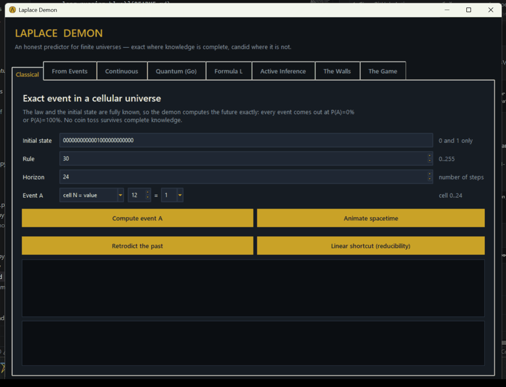

<div align="center">

# Демон Лапласа

### Честная лаборатория предсказаний для конечных вселенных — точная там, где знание полно, откровенная там, где нет


[](https://github.com/madnessbrainsbl/Laplace_Demon/actions/workflows/ci.yml)


[English](README.md) • [Русский](README.ru.md)



</div>

**Случайность — это не свойство мира, а зазор в знании наблюдателя.** Этот
проект доводит тезис до исполняемого кода: честный «демон Лапласа» с графическим
интерфейсом — точный там, где знание полно, и откровенный там, где наука ставит
стены. Ноль зависимостей: стандартная библиотека Python + собранное Go-ядро.

## Графический интерфейс

Дважды щёлкни `start_gui.cmd` или запусти:

```powershell
cd demon_laplas
python gui.py
```

## Визуализация (анимация)

Питона хватает: всё рисуется на `tk.Canvas` без единой новой зависимости
([viz.py](viz.py)). Каждая анимация — генератор, рисующий по кадру за вызов и
оставляющий готовую диаграмму на экране в конце. **Анимация сама и есть график.**

- **Classical / From Events** — кнопка *Animate spacetime*: мир строится по
  строке за кадром, вырастает тот самый треугольник правила 30. Видно, почему у
  демона нет ярлыка — структуру приходится прожить шаг за шагом.
- **Continuous** — *Animate the system*: мяч летит и падает на землю (демон
  назвал момент удара заранее), либо два маятника из почти одинакового старта
  расходятся; красный — «призрак» с ошибкой 1e-6, подпись показывает момент
  выхода за горизонт.
- **Active Inference** — *Animate foraging*: клетки загораются золотом по мере
  наблюдения, полоса `L_O` растёт. На правиле 60 видно плато — три хода полоса
  стоит на нуле, потом скачок в единицу.

Ничего не публикуется наружу, анимации живут только в приложении.

Событие A/E во всех вкладках задаётся конструктором (тип вопроса + номер
клетки/кубита + значение), поэтому синтаксически неверное событие собрать
нельзя; границы номеров следуют за шириной мира. Интерфейс полностью на
английском языке. Восемь вкладок: **Classical** (точный классический расчёт +
Retrodict + Linear shortcut), **From Events** (демон из событий), **Continuous**
(RK4 и горизонт Ляпунова), **Quantum (Go)** (Go-ядро с декогеренцией, квантовая
стена, CHSH, Read a qubit, Rewind), **Formula L** (информационная формула +
световой конус + макроэнтропия), **Active Inference** (агент Фристона,
покупающий знание), **The Walls** (Бекенштейн, Ландауэр, Гёдель/Вольперт) и
**The Game** (обгони демона).

## Active Inference (принцип свободной энергии)

Вкладка **Active Inference** — демон не дан готовым, а *становится* демоном,
покупая знание. Ожидаемая свободная энергия агента без предпочтений сводится к
чистому любопытству: наблюдай клетку, снимающую больше всего неопределённости.
`L_O` растёт с каждым эпистемическим действием ([fep.py](fep.py)).

```powershell
python fep.py --width 7 --rule 30 --steps 1 --event cell3=1
python fep.py --width 7 --rule 60 --steps 1 --event cell3=1
```

Правило 60 — самый интересный случай. Закон там XOR-подобный, и жадное
любопытство **буксует**: три наблюдения подряд приносят ровно ноль информации,
агент платит 4 клетки там, где оптимум берёт 2. Эпистемическая ценность не
субмодулярна — градиентное любопытство переплачивает. Программа это обнаруживает
и честно сообщает (`EPISTEMIC PLATEAU`, `Greedy is NOT optimal`).

## Квантовая стена

Кнопка **Wavefunction limit (before environment)** на вкладке Quantum
([walls.py](walls.py)) считает `L_O` для квантового события, когда знание K =
*полная волновая функция* в рамках операциональной квантовой модели. Параметры
среды для этого отдельного отчёта не применяются:

```text
H(E) = 1.000000 бит
H(E | full state) = 1.000000 бит
I(E;K) = 0.000000 бит
L_O = 0.000000
```

При фиксированной волновой функции энтропия отдельного результата измерения не
падает. Это операциональный вывод данной модели, а не доказательство против всех
интерпретаций: детерминистские интерпретации добавляют переменные, которых эта
программа не хранит и не умеет делать доступными наблюдателю.

Там же — комплементарность (Гейзенберг в битах): `H(Z) + H(X) >= 1`
(Maassen–Uffink). Определить одну наблюдаемую можно только ценой полного незнания
другой.

## Непрерывный демон

Вкладка **Continuous** моделирует мяч с сопротивлением воздуха и двойной
маятник методом RK4. Оба бага из
аудита chat_5.6_sol.md исправлены: интегрирование мяча останавливается в момент
удара о землю (t=3.306 с), а показатель Ляпунова измеряется методом Бенеттина,
и горизонт `T_pred = (1/λ)·ln(δ_доп/δ₀)` считается из измеренного значения
(для маятника λ≈1.6, а не постулированные 5 — поэтому t=5 с при δ₀=1e-6 ещё
ВНУТРИ горизонта, как и указал аудит).

```powershell
python mechanics.py --system pendulum --horizon 5 --error 1e-6 --tolerance 1.0
```

## Запреты

Вкладка **The Walls** демонстрирует стены, которые раньше соблюдались только
по построению:

- **Ёмкость знания (Бекенштейн).** `H_irr(m) = min H(E|K)` по всем наборам K из
  m клеток — формула аудита `inf по классу доступных знаний`. Профиль показывает,
  сколько бит минимально нужно демону, чтобы событие стало определённым. Вторая
  кнопка считает физический предел `I <= 2πRE/(ħc·ln2)` для носителя заданных
  радиуса и энергии. Честная оговорка в самом отчёте: для игрушечных миров предел
  астрономически слаб и сам по себе НЕ доказывает, что предсказатель обязан быть
  больше системы (пункт 5 аудита).
- **Диагональ X* (Гёдель/Вольперт).** Мир, который читает публикацию демона и
  делает наоборот: перебираются ВСЕ возможные стратегии — внутри мира каждая
  ошибается всегда, снаружи полный демон существует.
- **Две машины друг о друге.** Перебор всех совместных исходов: ни одна пара не
  может сильно инферить друг друга — конечная иллюстрация результата Вольперта
  ([arXiv:0708.1362](https://arxiv.org/abs/0708.1362)).

```powershell
python information.py --width 7 --rule 30 --steps 1 --event cell3=1 --min-knowledge
python walls.py --radius 0.1 --energy 1.0 --required-bits 3
python godel.py
```

## Прошлое, ярлык, Белл и цена знания

Четыре демонстрации, закрывающие определение Лапласа целиком:

- **Retrodict the past** (Classical) — Лаплас обещал демону и прошлое. Кнопка
  перебирает все прообразы состояния: вперёд закон даёт один мир, назад — 0
  (сад Эдема), 1 (обратимо здесь) или много (стрела времени: биты истории
  уничтожены, и полное знание настоящего не говорит, какое прошлое было).
- **Linear shortcut** (Classical) — сводимость против несводимости. Восемь
  правил из 256 линейны над GF(2): для них демон прыгает через 10^18 шагов за
  миллисекунды (возведение полинома шага в степень, O(log t)). Для правила 30
  ярлыка не знает никто — программа честно отказывает. Контраст этих двух
  ответов и есть стена Вольфрама. CLI: `python shortcut.py --rule 90 --steps
  1000000000000000000`.
- **CHSH: Bell test** (Quantum) — тест Белла числом: локально-детерминированный
  предел S <= 2, белловская пара даёт точные 2*sqrt(2) = 2.828427 (граница
  Цирельсона). Никакой классический демон с заранее записанными ответами не
  воспроизведёт эти корреляции.
- **Landauer cost of knowledge** (The Walls) — цена знания в джоулях: стирание
  бита стоит kT*ln2 (ответ Беннетта демону Максвелла, подтверждён экспериментом
  в 2012). Минимальный демон из H_irr умножается на температуру носителя —
  «знание физично» становится числом.

## Демон внутри мира, измерение и второй закон

Три демонстрации, замыкающие ЗАПРЕТЫ.md кодом:

- **Embedded demon (light cone)** (Formula L, [cone.py](cone.py)) — «нет
  глобального сейчас»: сигналы идут 1 клетку/шаг, и демон, живущий в клетке p,
  за T шагов узнаёт только конус радиуса T. Отчёт показывает L_O для каждого
  места в мире: быть всезнающим — свойство того, ГДЕ ты сидишь. Внешний демон
  других вкладок получает весь срез настоящего как дар, недоступный ни одному
  обитателю.
- **Read a qubit** (Quantum) — «измерение возмущает»: чтение кубита = полная
  дефазировка. Чистота белловской пары падает 1.0 → 0.5 самим актом извлечения
  бита; знание не только стоит джоулей — оно оставляет следы. Для классического
  бита чтение бесплатно, и отчёт честно это говорит.
- **Macro entropy (second law)** (Formula L, [macro.py](macro.py)) —
  термодинамика как незнание по построению: наблюдатель видит только суммы
  блоков, микромир детерминирован, а H(macro) растёт с 0 до ~5 бит без единого
  случайного события. Правило 204 (тождество) макронезнания не создаёт — не
  каждый закон делает термодинамический мир.

```powershell
python cone.py --width 7 --rule 30 --horizon 1 --event cell3=1
python macro.py --width 12 --rule 30 --steps 8
```

## Rewind и игра

- **Rewind** (Quantum) — унитарный мир помнит: программа гейтов, прогнанная
  вперёд и задом наперёд (H, X, CNOT самообратны), возвращает состояние точно,
  P(return)=1. Одно чтение кубита посередине ломает возврат (для белловской
  пары — до 0.5): стрела времени входит в квантовую механику через измерение и
  среду, но никогда — через сам закон.
- **The Game** (восьмая вкладка) — обгони демона: скрытый мир крутит правило 30,
  ты называешь следующий бит центральной колонки. Демон не угадывает — он
  вычисляет (всегда 100%); человек застревает у линии монетки ~50%. Та самая
  «случайность = зазор знания», пережитая лично: каждый бит был определён до
  твоей догадки.

## Демон из событий

Вкладка **From Events** — демон, которому закон *не задан*. Он получает
только историю наблюдённых состояний (через `;`), выводит из переходов известные
строки локального закона, перебирает все правила, совместимые с событиями, и
предсказывает:

- если все совместимые законы дают один исход — событие ОПРЕДЕЛЕНО;
- если законы расходятся — демон честно сообщает P(A) при равновозможных законах;
- если история противоречит любому детерминированному локальному закону —
  сообщается ошибка (наблюдения несовместимы с детерминизмом).

CLI-вариант:

```powershell
python events.py --history "0001000; 0011100; 0110010" --steps 20 --event cell3=1
```

Чем длиннее история, тем меньше совместимых правил: одно состояние допускает все
256 законов, богатая история сужает их до единственного. Это демон Лапласа в
исходном смысле: знание закона добывается из событий, а не постулируется.

Вкладка **Formula L** перебирает все возможные начальные состояния конечного
мира и считает:

```text
R = H(E|K)
I(E;K) = H(E) - H(E|K)
L = I(E;K) / H(E)
```

`K` задаётся индексами известных клеток (`0,3,5`), `all` или `none`.
При `H(E)=0` программа явно применяет соглашение `L=1` для тривиально
неизменного события.

CLI-вариант:

```powershell
python information.py --width 7 --known 2,3,4 --rule 30 --steps 1 --event cell3=1
```

Программа точно предсказывает конечную детерминированную «вселенную» — кольцо
битовых клеток с известным правилом эволюции:

```text
x(t + n) = F_rule^n(x(t))
```

Это настоящий демон только внутри модели: состояние конечно, закон полностью
известен, вычисления целочисленные, внешнего шума нет. Физическую Вселенную
программа не предсказывает.

`experiment.py` повторяет содержательную идею научного проекта
[LaplaceDemonSims](https://github.com/zgompert/LaplaceDemonSims): запускает много
возможных траекторий и измеряет, как ошибки данных, незнание закона и внутренний
шум снижают предсказуемость.

## Запуск

```powershell
python demon.py --state 0001000 --rule 30 --steps 20
python demon.py --state 0001000 --rule 30 --steps 20 --cell 3
```

## Интерактивный режим

```powershell
python interactive.py
```

В режиме `classical` вводятся начальное состояние, правило, горизонт и событие:

```text
cell3=1
state=0011100
```

Для полностью заданной классической модели ответ всегда равен `P(A)=100%` или
`P(A)=0%`.

В режиме `quantum` вводятся базисное состояние, гейты и событие. Поддерживаются:

```text
H 0; X 1; CNOT 0 1
q0=1
q0=q1
state=11
```

Пример по умолчанию создаёт запутанное состояние Белла. Событие `q0=q1`
определено на 100%, но отдельный исход `q0=0` имеет вероятность 50%. Программа не
подменяет такой исход детерминированным ответом.

## Нативное квантовое ядро на Go

На машине установлен Go 1.24, поэтому расчёт матрицы плотности и взаимодействия
со средой вынесен в нативную программу без сторонних зависимостей:

```powershell
cd native_quantum
go run .
```

Поддерживаются `H`, `X`, `CNOT`, матрица плотности, фазовая декогеренция,
амплитудное затухание и события `qN=0/1`, `qN=qM`, `state=bits`.
Размер ограничен 10 кубитами: матрица плотности требует `4^n` комплексных чисел.
Параметры среды применяются к одному выбранному кубиту: `0` отключает канал,
`1` задаёт полную декогеренцию или полное амплитудное затухание.

Проверка и сборка:

```powershell
go test ./...
go build -buildvcs=false -o quantum-demon.exe .
.\quantum-demon.exe
```

Go ускоряет численное ядро относительно чистого Python, но не превращает
вероятностный квантовый исход в детерминированный и не моделирует полную QFT.

Классический CLI `demon.py` выводит JSON. `exact_within_model: true` означает
точность только при заданных начальном состоянии и правиле.

Если состояние повторяется, дальнейшая эволюция циклична. Программа обнаруживает
цикл и сразу вычисляет состояние даже на далёком горизонте.

## Эксперимент как в LaplaceDemonSims

```powershell
python experiment.py
```

Программа сравнивает шесть условий:

- `perfect` — состояние и закон известны точно;
- `measurement_error` — ошибки начального состояния;
- `model_error` — ошибки в таблице закона;
- `intrinsic_noise` — случайные изменения во время эволюции;
- `combined` — все источники вместе;
- `improved_data` — ошибки данных и модели уменьшены в пять раз.

В консоли появится итоговая предсказуемость и горизонт, на котором она стала
ниже `0.95`. Полные результаты сохраняются в `results.csv` и открываются в Excel.
По умолчанию считаются 10 шагов: у хаотического правила 30 более длинный горизонт
быстро перемешивает все сценарии и скрывает пользу улучшенных данных.

Настройки:

```powershell
python experiment.py --state 0001000 --rule 30 --steps 100 --runs 500 --seed 42 --output results.csv
```

`predictability = 1` означает, что все возможные траектории совпадают по каждой
клетке. Значение уменьшается по мере расхождения траекторий. `exact_match_rate`
показывает долю прогонов, полностью совпавших с эталонной траекторией.

## Проверка

```powershell
python -m unittest -v
```
