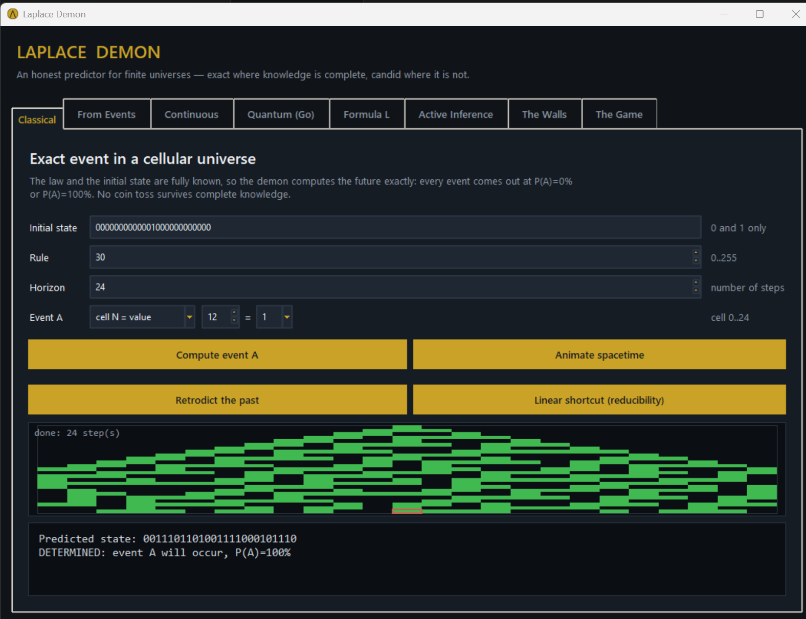

# Local Laplace Demon

[Русский](README.md) | **English**

**Randomness is not a property of the world — it is a gap in the observer's
knowledge.** This project turns that thesis into executable code: an honest
Laplace's demon with a GUI — exact where knowledge is complete, candid where
science builds walls. Zero dependencies: Python stdlib + a prebuilt Go kernel.
License: [MIT](LICENSE).



## What's new

The latest wave of changes closed Laplace's original definition end to end:

- **Retrodict the past** (Classical) — exact predecessor enumeration: Gardens
  of Eden, unique pasts, and the arrow of time as destroyed history bits.
- **Linear shortcut** (Classical) — GF(2) fast-forward: 10^18 steps in
  milliseconds for the eight linear rules, an honest refusal for Rule 30 —
  computational reducibility vs irreducibility side by side.
- **CHSH before environment** (Quantum) — a numerical Bell test: entangled
  pairs reach the Tsirelson bound 2*sqrt(2), local determinism stops at 2.
- **Read a qubit** (Quantum) — measurement as disturbance: extracting one bit
  halves the purity of a Bell pair; reading a classical bit is free.
- **Rewind** (Quantum) — the unitary world remembers: forward + reversed
  program returns the state exactly, unless a reading broke the return.
- **Landauer cost of knowledge** (The Walls) — the demon's memory priced in
  joules: kT*ln2 per erased bit.
- **Embedded demon / light cone** (Formula L) — no global "now": a demon
  living inside the world only ever knows its cone; omniscience is a property
  of where you sit.
- **Macro entropy** (Formula L) — the second law for a coarse observer:
  deterministic micro-dynamics, growing macro-uncertainty.
- **The Game** (new tab) — outrun the demon: call Rule 30's next bit; the
  demon computes (100%), a bounded observer hovers at the coin line (~50%).
- Structured input everywhere: event pickers, a gate-program builder, bounded
  spinboxes and keystroke filters — an invalid input can no longer be typed.
- 102 unit tests, Go test/vet, and a 52-check GUI verification drive.

## Graphical interface

Double-click `start_gui.cmd` or run:

```powershell
cd demon_laplas
python gui.py
```

## Visualization and animation

Python is sufficient: everything is drawn on `tk.Canvas` without additional
dependencies ([viz.py](viz.py)). Each animation is a generator that draws one
frame per call and leaves the completed diagram on the canvas. **The animation
itself is the plot.**

- **Classical / From Events** — *Animate spacetime* builds the world one row at
  a time and reveals the familiar Rule 30 triangle. It demonstrates why the
  demon does not always have a shortcut: the structure may have to be evolved
  step by step.
- **Continuous** — *Animate the system* shows either a ball falling to the
  ground after its impact time was predicted, or two double pendulums diverging
  from almost identical initial states. The red trajectory is the perturbed
  system, and the caption marks when it leaves the prediction horizon.
- **Active Inference** — *Animate foraging* highlights observed cells while the
  `L_O` bar rises. Rule 60 produces a plateau: three observations provide no
  information before the coefficient jumps to one.

Nothing is published externally. All animations remain inside the application.

Events A/E are created with structured controls on every tab: question type,
cell or qubit index, and value. This makes syntactically invalid events
impossible to assemble, while index limits track the current world size.

The interface is entirely in English and contains eight tabs:

- **Classical** — exact deterministic calculation, plus Retrodict and the
  linear shortcut;
- **From Events** — inferring a law from observations;
- **Continuous** — RK4 integration and the Lyapunov horizon;
- **Quantum (Go)** — a native density-matrix kernel with environmental noise,
  the wavefunction limit, CHSH, Read a qubit, and Rewind;
- **Formula L** — the information-theoretic Laplace coefficient, the embedded
  light-cone demon, and macro entropy;
- **Active Inference** — an epistemic agent that acquires knowledge;
- **The Walls** — Bekenstein, Landauer, Gödel/Wolpert, and related limits;
- **The Game** — outrun the demon by calling Rule 30's next bit.

## Active inference and the free-energy principle

On the **Active Inference** tab, the demon is not supplied fully formed. It
*becomes* a local demon by acquiring observations. With no preferred outcome,
the agent selects the cell that removes the most uncertainty. `L_O` increases
with each epistemic action ([fep.py](fep.py)).

```powershell
python fep.py --width 7 --rule 30 --steps 1 --event cell3=1
python fep.py --width 7 --rule 60 --steps 1 --event cell3=1
```

Rule 60 is the most instructive example. Its XOR-like law makes greedy
curiosity **stall**: three successive observations provide exactly zero
information, so the agent pays for four cells while the exhaustive optimum
needs only two. Epistemic value is not submodular in this case, and the program
reports this honestly with `EPISTEMIC PLATEAU` and `Greedy is NOT optimal`.

## The quantum wall

The **Wavefunction limit (before environment)** button on the Quantum tab
([walls.py](walls.py)) calculates `L_O` for a quantum event when K is the
*complete wavefunction* available to this operational model. Environmental
parameters are intentionally not applied to this separate report:

```text
H(E) = 1.000000 bits
H(E | full state) = 1.000000 bits
I(E;K) = 0.000000 bits
L_O = 0.000000
```

For a fixed wavefunction, knowing the wavefunction does not remove the entropy
of one measurement result. This is an operational conclusion of this model,
not a proof against every interpretation of quantum mechanics. Deterministic
interpretations add variables that this program neither stores nor makes
available to the observer.

The same report shows entropic complementarity, or Heisenberg uncertainty in
bits: `H(Z) + H(X) >= 1` (Maassen–Uffink). Determining one observable comes at
the cost of uncertainty about the complementary observable.

## Continuous demon

The **Continuous** tab models a ball with linear air resistance and a chaotic
double pendulum using RK4. Ball integration stops at ground impact
(`t ≈ 3.306 s`). The largest Lyapunov exponent is measured with Benettin
renormalization rather than assumed, and the prediction horizon is calculated
from that measured value:

```text
T_pred = (1 / λ) * ln(δ_tolerance / δ_0)
```

For the supplied pendulum, `λ ≈ 1.6 1/s`; therefore `t = 5 s` with
`δ_0 = 1e-6` is still inside the measured horizon.

```powershell
python mechanics.py --system pendulum --horizon 5 --error 1e-6 --tolerance 1.0
```

## Physical and logical walls

The **The Walls** tab demonstrates limits that were previously enforced only by
construction:

- **Knowledge capacity (Bekenstein).** `H_irr(m) = min H(E|K)` is calculated
  over every knowledge set K containing m cells. The profile reports how many
  state bits are minimally required to determine the event. A separate button
  evaluates the physical bound `I <= 2πRE/(ħc·ln2)` for a carrier with the
  specified radius and energy. For toy worlds this bound is astronomically
  loose and does not by itself prove that a predictor must be larger than its
  system.
- **Diagonal X* (Gödel/Wolpert).** The world reads the demon's published
  prediction and does the opposite. Every possible one-bit strategy fails when
  the predictor is inside the world, while an external predictor succeeds.
- **Two devices inferring one another.** Exhaustive enumeration of all joint
  outputs gives a finite illustration of Wolpert's result: two distinguishable
  devices cannot both strongly infer each other
  ([arXiv:0708.1362](https://arxiv.org/abs/0708.1362)).

```powershell
python information.py --width 7 --rule 30 --steps 1 --event cell3=1 --min-knowledge
python walls.py --radius 0.1 --energy 1.0 --required-bits 3
python godel.py
```

## The past, shortcuts, Bell, and the physical price of knowledge

Four demonstrations complete the local interpretation of Laplace's idea:

- **Retrodict the past** (Classical) — Laplace's intelligence was expected to
  know the past as well as the future. The program enumerates every predecessor
  of the current state. Forward evolution produces one future, while backward
  evolution may produce zero predecessors (a Garden of Eden), one predecessor,
  or many. Multiple predecessors expose an arrow of time: information about
  history was destroyed, so complete knowledge of the present is insufficient
  to reconstruct one unique past.
- **Linear shortcut** (Classical) — reducibility versus irreducibility. Eight of
  the 256 elementary rules are linear over GF(2). For those rules, polynomial
  exponentiation jumps across `10^18` steps in milliseconds with `O(log t)`
  work. No shortcut is known for Rule 30, and the program refuses honestly.
  This contrast illustrates the computational-irreducibility wall.

  ```powershell
  python shortcut.py --rule 90 --steps 1000000000000000000
  ```

- **CHSH before environment** (Quantum) — the program calculates the maximum
  CHSH value `S_max` for the selected qubit pair in the unitary state. Every
  Bell state reaches the Tsirelson bound `2*sqrt(2) = 2.828427`; local
  deterministic correlations satisfy `S <= 2`. Dephasing and damping are not
  applied in this report, which is stated explicitly in its output.
- **Landauer cost of knowledge** (The Walls) — erasing one bit costs at least
  `kT*ln2` joules. The minimal knowledge from `H_irr` is multiplied by the
  carrier temperature, turning “information is physical” into a numerical
  lower bound.

## The demon inside the world, measurement, and the second law

Three demonstrations that turn the remaining prohibitions into running code:

- **Embedded demon (light cone)** (Formula L, [cone.py](cone.py)) — there is no
  global "now": signals travel one cell per step, so a demon living at cell p
  and predicting T steps ahead has heard from at most a radius-T cone. The
  report shows `L_O` for every seat in the world — omniscience turns out to be
  a property of WHERE you sit, not how clever you are. The external demon of
  the other tabs receives the whole present as a gift no inhabitant gets.
- **Read a qubit** (Quantum) — measurement disturbs: reading a qubit equals
  full dephasing. The purity of a Bell pair drops from 1.0 to 0.5 through the
  act of extracting one bit; knowledge not only costs joules — it leaves
  fingerprints. Reading a classical bit is free, and the report says so.
- **Macro entropy (second law)** (Formula L, [macro.py](macro.py)) —
  thermodynamics as designed ignorance: the observer sees only block sums, the
  micro-world is strictly deterministic, yet H(macro) grows from 0 to ~5 bits
  without a single random event. Rule 204 (identity) creates no macro
  ignorance — not every law makes a thermodynamic world.

```powershell
python cone.py --width 7 --rule 30 --horizon 1 --event cell3=1
python macro.py --width 12 --rule 30 --steps 8
```

## Rewind and The Game

- **Rewind** (Quantum) — the unitary world remembers: a gate program run
  forward and then in reverse (H, X and CNOT are self-inverse) returns the
  state exactly, P(return) = 1. One reading of a qubit midway breaks the
  return (down to 0.5 for a Bell pair): the arrow of time enters quantum
  mechanics through measurement and environment, never through the law itself.
- **The Game** (eighth tab) — outrun the demon: a hidden 31-cell world runs
  Rule 30 and you call the next bit of the center column. The demon never
  guesses — it computes (always 100%); a bounded observer hovers at the coin
  line (~50%). "Randomness is a knowledge gap," experienced first-hand: every
  bit was determined before you guessed it.

## Demon from events

On the **From Events** tab, the law is not given. The demon receives only a
semicolon-separated history of observed states, reconstructs known rows of the
local rule table, enumerates every rule consistent with the observations, and
then predicts:

- if all consistent laws agree, the event is **DETERMINED**;
- if the laws disagree, the program reports `P(A)` under an explicit uniform
  prior over the remaining rules;
- if the observations contradict every deterministic local rule, the program
  reports an error.

Command-line example:

```powershell
python events.py --history "0001000; 0011100; 0110010" --steps 20 --event cell3=1
```

A single state permits all 256 rules. A richer history narrows the set and may
identify one law uniquely. This captures the original Laplacean idea that the
law can be learned from events rather than simply postulated.

## Formula L

The **Formula L** tab enumerates every possible initial state of a finite world
and calculates:

```text
R = H(E|K)
I(E;K) = H(E) - H(E|K)
L = I(E;K) / H(E)
```

`K` is specified with known cell indexes such as `0,3,5`, or with `all` and
`none`. When `H(E)=0`, the program explicitly uses the convention `L=1` for an
event that is already fixed.

Command-line example:

```powershell
python information.py --width 7 --known 2,3,4 --rule 30 --steps 1 --event cell3=1
```

## Exact classical world

The core program exactly predicts a finite deterministic universe: a periodic
ring of binary cells evolving under a known elementary cellular-automaton rule.

```text
x(t + n) = F_rule^n(x(t))
```

It is a genuine demon only inside this model: the state is finite, the law is
known, computation is discrete, and no external noise exists. It does not
predict the physical Universe.

`experiment.py` follows the substantive idea of
[LaplaceDemonSims](https://github.com/zgompert/LaplaceDemonSims): it runs many
possible trajectories and measures how data errors, law uncertainty, and
intrinsic noise reduce predictability.

## Command-line usage

```powershell
python demon.py --state 0001000 --rule 30 --steps 20
python demon.py --state 0001000 --rule 30 --steps 20 --cell 3
```

The classical CLI writes JSON. `exact_within_model: true` means exact only for
the supplied initial state and rule. If a state repeats, later evolution is
cyclic; the predictor detects that cycle and can answer very distant horizons
without replaying every step.

## Interactive terminal mode

```powershell
python interactive.py
```

Classical mode accepts an initial state, rule, horizon, and event:

```text
cell3=1
state=0011100
```

For a fully specified classical model, the answer is always `P(A)=100%` or
`P(A)=0%`.

Quantum mode accepts a basis state, gate program, and event:

```text
H 0; X 1; CNOT 0 1
q0=1
q0=q1
state=11
```

The default program creates an entangled Bell state. The event `q0=q1` is
certain, while one local result such as `q0=0` has probability 50%. The program
does not replace that distribution with a fabricated deterministic answer.

## Native Go quantum kernel

The density-matrix calculation and environmental channels are implemented in a
native Go 1.24 program without third-party dependencies:

```powershell
cd native_quantum
go run .
```

The kernel supports `H`, `X`, `CNOT`, density matrices, phase damping,
amplitude damping, and the events `qN=0/1`, `qN=qM`, and `state=bits`. The limit
is 10 qubits because a density matrix stores `4^n` complex numbers.
Environmental parameters apply to one selected qubit: `0` disables a channel,
while `1` requests complete phase damping or amplitude damping.

Test and build:

```powershell
go test ./...
go build -buildvcs=false -o quantum-demon.exe .
.\quantum-demon.exe
```

Go accelerates the numerical kernel relative to pure Python, but it cannot turn
a probabilistic measurement outcome into a deterministic one and does not model
full quantum field theory.

## Predictability experiment

```powershell
python experiment.py
```

The experiment compares six conditions:

- `perfect` — exact initial state and law;
- `measurement_error` — errors in the measured initial state;
- `model_error` — errors in the rule table;
- `intrinsic_noise` — random changes during evolution;
- `combined` — all error sources together;
- `improved_data` — data and model errors reduced by a factor of five.

The terminal shows final predictability and the first horizon where it falls
below `0.95`. Full measurements are written to `results.csv`. The default run
uses ten steps; at much longer horizons, chaotic Rule 30 mixes trajectories so
strongly that it can hide the benefit of improved input data.

Custom settings:

```powershell
python experiment.py --state 0001000 --rule 30 --steps 100 --runs 500 --seed 42 --output results.csv
```

`predictability = 1` means that every possible trajectory agrees in every cell.
The value decreases as trajectories diverge. `exact_match_rate` is the fraction
of runs whose complete state matches the noise-free reference trajectory.

## Verification

```powershell
python -m unittest -v
```

The current project also includes Go tests for the native quantum kernel:

```powershell
Set-Location -LiteralPath '.\native_quantum'
go test ./...
```
